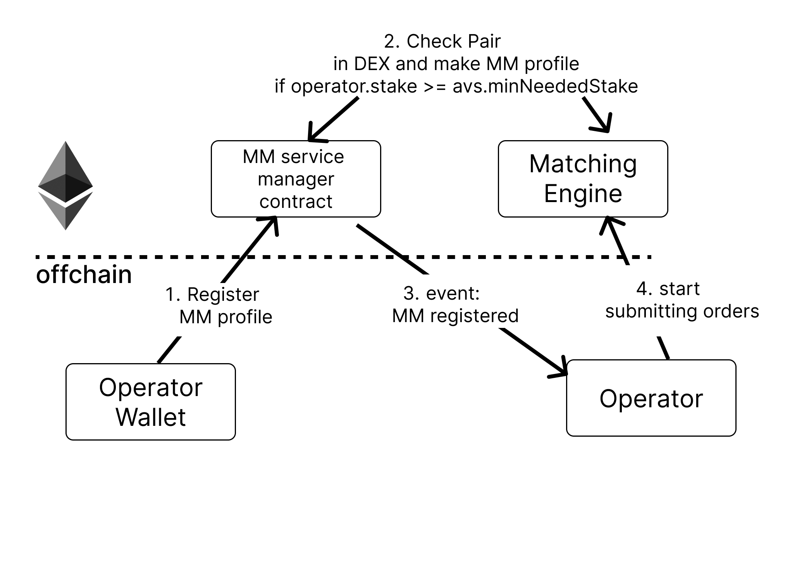
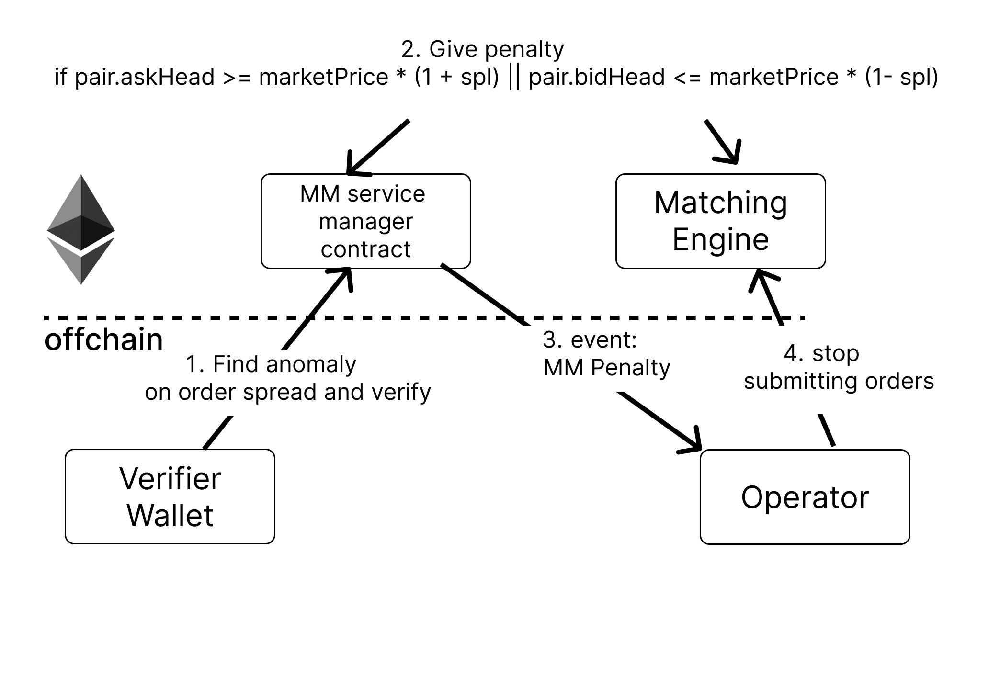

# Standard market maker AVS

This is an Eigenlayer AVS by Standard to improve on solver design from async swap by CoWswap. The software was generated for capstone project for  [Uniswap hook incubator](https://atrium.academy/uniswap).

This project shows you the simplest functionality you can expect from an AVS with market making orderbook.

The diagram will give you a concrete understanding of the basic components with two cases.

### 1. Registering MM to service contract manager

There are 4 steps to this AVS registration for MM operators:

- AVS operator wallet submits registration request for MM profile
- Check Pair in DEX and make MM profile if operator.stake >= avs.minNeededStake
- event: MMRegistered(bytes32 taskHash, address agent)
- AVS operator client starts submitting orders

### 2. Verifying MM is acting as according to limit

There are 4 steps to this AVS verificaiton and penalty:

- AVS verifier finds anomaly on order spread and verify
- Suppose spl is spread limit, MMServiceManager gives penalty if pair.askHead >= marketPrice * (1 + spl) || pair.bidHead <= marketPrice * (1- spl) after getting bidHead(Highest Bid) askHead(Lowest Ask) prices
- event: MMPenalized(bytes32 taskHash, address agent);
- AVS operator client stops submitting orders

Where additional sophistication with AVSs come into the picture:

- the nature of the request is more sophisicated than generating a constant string
- the operators might need to coordinate with each other, but not sure how penalty is applied 
- the type of signature is different based on the constraints of the service
- the type and amount of security used to secure the AVS
- and so on...

### Comparison

|                     | Standard Eigenlayer AVS market maker                                                                                                         | CoWswap Solver                                       |
| ------------------- | -------------------------------------------------------------------------------------------------------------------------------------------- | ---------------------------------------------------- |
| Mission             | Spread buy/sell orders in the orderbook within 2% spread on market price                                                                     | Match orders in whatever solvers want                |
| Verification method | Measure bid/ask head price and check with last market price that its difference is within 2% of the market price in orderbook smart contract | N/A                                                  |
| Transparent         | Yes                                                                                                                                          | N/A                                                  |
| Centralization Risk | None, all transparent and clear, all done in smart contract                                                                                  | Payment for order flow can happen. |

## Quick Start

### Dependencies

1. [npm](https://docs.npmjs.com/downloading-and-installing-node-js-and-npm)
2. [Foundry](https://getfoundry.sh/)
3. [Docker](https://www.docker.com/get-started/)

### Steps

1. Make sure Docker is running

2. Run `make start-chain-with-contracts-deployed`

   2.1 This will build the contracts, start an Anvil chain, deploy the contracts to it, and leaves the chain running in the current terminal

3. Open new terminal tab and run `make start-operator`

   3.1 This will compile the AVS software and start monitering new tasks

4. Open new terminal tab and run `make spam-tasks` (Optional)

   4.1 This will spam the AVS with random names every 15 seconds

### Deploy

Operator can be deployed with [Railway](https://railway.app/) thanks to [Ponder](https://ponder.sh/) after registering an operator wallet to service manager contract. Check this [guide](https://ponder.sh/docs/production/deploy) on how to deploy.

## Extensions

- Operator needs a minimum stake amount to make submissions
- Add another strategy to the AVS
- Operator must respond within a certain number of blocks
